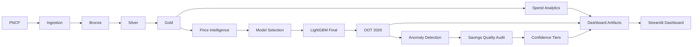

# Procurement Intelligence Platform

Plataforma de **Spend, Supplier & Price Intelligence** construída sobre dados públicos do **PNCP**, combinando **Data Engineering, Analytics e Machine Learning** para apoiar decisões de Procurement.

O projeto transforma dados brutos de compras em uma camada analítica capaz de responder perguntas como:

- Onde o spend está concentrado?
- Quais categorias apresentam maior dependência de fornecedores?
- Quais preços estão significativamente fora do padrão esperado?
- Quais casos merecem investigação ou negociação?
- Quanto do potencial financeiro identificado é suficientemente confiável para uso executivo?
- O modelo continua estável fora do período de desenvolvimento?

> **Importante:** os dados do PNCP representam compras públicas e são utilizados como **proxy** para demonstrar técnicas aplicáveis a Procurement Intelligence. Os resultados não representam processos ou dados reais de compras bancárias.

---

## Visão executiva

O projeto cobre o fluxo completo:

```text
PNCP
  ↓
Ingestion
  ↓
Bronze
  ↓
Silver
  ↓
Gold
  ↓
Spend & Supplier Intelligence
  ↓
Price Intelligence / Machine Learning
  ↓
Anomaly Detection
  ↓
Savings Quality Audit
  ↓
Decision Support Dashboard
```

A camada Gold possui aproximadamente **5,8 milhões de registros**, preservando o histórico de compras e as dimensões necessárias para análise de fornecedores, itens, categorias e preços.

A população oficial de Price Intelligence possui **138.396 observações**:

| Período | Papel | Observações |
|---|---:|---:|
| 2024 | Development train | 46.143 |
| 2025 | Validation / model selection | 57.452 |
| 2026 | Final out-of-time test | 24.692 |

O protocolo temporal foi definido antes da avaliação final de 2026 para evitar seleção de modelo baseada no conjunto de teste.

---

## Principais resultados

### Modelo final — OOT 2026

O algoritmo selecionado foi **LightGBM**.

| Métrica | OOT 2026 |
|---|---:|
| Observações | 24.692 |
| MAE log | 1,2358 |
| RMSE log | 1,7136 |
| MedAPE | 74,86% |
| WAPE | 93,77% |
| Known MAE log | 1,1174 |
| Unseen item rate | 21,60% |

A performance de itens conhecidos permaneceu praticamente estável entre validação e teste final. O principal sinal de mudança em 2026 foi o aumento da participação de itens **unseen**, de **16,22% para 21,60%**.

O Total Variation Distance do mix de categorias foi de apenas **2,77%**, sugerindo baixa mudança estrutural no mix analisado.

---

### Model selection

O projeto não assumiu LightGBM como solução a priori.

Foram comparados:

- Median Baseline;
- Ridge Regression;
- CatBoost;
- XGBoost;
- LightGBM.

A seleção utilizou validação temporal em 2025 e **clustered paired bootstrap** dos erros por `item_key`.

No mesmo conjunto coberto pelo baseline de mediana, o LightGBM reduziu o MAE log em aproximadamente **33,8%**.

LightGBM e XGBoost ficaram estatisticamente muito próximos no bootstrap. LightGBM foi mantido como vencedor operacional pelo menor MAE primário, melhor comportamento em itens unseen e integração já existente no pipeline.

Uma etapa posterior de tuning encontrou melhoria inferior a 0,2% e sem evidência estatística suficiente. Por parcimônia, a configuração original foi preservada.

---

## Price Intelligence

O objetivo da camada de Price Intelligence é estimar um **preço esperado** condicionado ao contexto do item e identificar observações com desvios relevantes.

O alvo de modelagem é:

```text
log(unit_price)
```

A avaliação preserva a distinção entre:

```text
Known
→ item_key observado no histórico de treinamento

Unseen
→ item_key não observado anteriormente
```

Essa separação é importante porque cold start apresentou erro consistentemente superior ao dos itens conhecidos.

---

## Anomaly Detection

O threshold oficial de anomalia é calibrado **somente na validação de 2025**, utilizando:

```text
Known items
+
P95 do abs_log_error
```

Threshold congelado:

```text
abs_log_error = 3,284766
```

O mesmo valor é aplicado ao OOT 2026 sem recalibração.

Resultados:

| Período | Taxa de anomalias known |
|---|---:|
| Validação 2025 | 5,00% |
| OOT 2026 | 4,81% |

Em 2026 foram identificadas:

```text
931 anomalias known
494 acima do preço esperado
437 abaixo do preço esperado
```

> Uma anomalia estatística não representa fraude ou sobrepreço comprovado. Ela representa um caso que merece investigação adicional.

---

## Savings Opportunities

Somente anomalias:

```text
Known
+
Acima do preço esperado
+
Threshold congelado
```

podem gerar uma oportunidade inicial de Savings.

A fórmula é:

```text
Potential Savings =
max(unit_price - expected_price, 0) × quantity
```

Porém, o valor bruto não é utilizado diretamente como KPI executivo.

Antes disso, cada oportunidade passa por auditoria de:

- comparabilidade de unidade;
- suporte histórico;
- consistência entre preço, quantidade e valor total;
- conflitos de resultado;
- tickets de alto valor.

### Confidence Tiers

| Confidence Tier | Oportunidades | Potential Savings | Uso |
|---|---:|---:|---|
| **Alta** | 13 | **R$ 15,0 mi** | KPI executivo |
| **Revisão Alto Valor** | 27 | **R$ 63,9 mi** | revisão manual |
| **Baixa** | 454 | não utilizada como KPI | diagnóstico |

O dashboard utiliza **R$ 15,0 milhões** como `Potential Savings — Alta Confiança`.

Os casos de alto valor são exibidos separadamente e não são somados ao KPI principal.

> Potential Savings representa oportunidade para revisão ou negociação. Não significa economia garantida, fraude ou irregularidade comprovada.

---

## Spend & Supplier Intelligence

A camada de Spend Intelligence inclui:

- spend por categoria;
- número de transações;
- fornecedores distintos;
- itens distintos;
- Curva ABC de fornecedores;
- concentração de fornecedores via HHI;
- participação do Top 1 e Top 3 fornecedores;
- tratamento de outliers de valor.

O HHI é calculado na escala de 0 a 10.000.

Referência utilizada no projeto:

```text
HHI < 1.500
→ não concentrado

1.500 ≤ HHI < 2.500
→ moderadamente concentrado

HHI ≥ 2.500
→ altamente concentrado
```

A Curva ABC classifica fornecedores conforme participação acumulada no spend:

```text
A → até 80%
B → 80% a 95%
C → restante
```

---

## Model Monitoring

O projeto não termina na métrica do teste final.

A camada de monitoramento compara validação 2025 e OOT 2026 em:

- MAE e RMSE;
- Known vs Unseen;
- unseen item rate;
- categoria;
- mix de categorias;
- distribuição de preços;
- estabilidade mensal;
- taxa de anomalias.

Leitura principal:

```text
Performance global
→ pequena deterioração

Known performance
→ praticamente estável

Category mix
→ baixa mudança

Price distribution
→ baixa mudança

Cold start / novelty
→ principal sinal de atenção
```

A interpretação adotada é que a pequena piora global está mais associada ao aumento da participação de itens unseen do que a uma deterioração generalizada do modelo.

---

## Dashboard

A aplicação foi construída em **Streamlit + Altair** com uma interface executiva orientada a decisão.

Páginas:

1. **Executive Overview**
2. **Spend & Suppliers**
3. **Price Intelligence**
4. **Savings Opportunities**
5. **Model Monitoring**
6. **Methodology**

O dashboard funciona apenas como camada de consumo.

Ele **não**:

- treina modelos;
- executa model selection;
- recalibra thresholds;
- recalcula métricas OOT;
- reconstrói Savings.

Os resultados analíticos são produzidos anteriormente e persistidos como artefatos validados.

```text
Analytics / Validation
        ↓
Persisted Artifacts
        ↓
dashboard_data.py
        ↓
Streamlit
```

---

## Arquitetura



---

## Estrutura do repositório

```text
procurement-intelligence/
│
├── app/
│   └── dashboard.py
│
├── docs/
│   └── adr/
│
├── notebooks/
│
├── scripts/
│   └── investigacoes/
│
├── src/
│   ├── analytics/
│   ├── ingestion/
│   ├── quality/
│   └── transformation/
│
├── tests/
│
└── README.md
```

### `src/ingestion`

Aquisição e leitura das fontes de dados.

### `src/transformation`

Transformações Bronze → Silver → Gold, construção da fact e dimensões analíticas.

### `src/quality`

Validações e regras de qualidade dos dados.

### `src/analytics`

Spend Analytics, modelos de preço, model selection, anomaly detection, Savings Engine, monitoring e carregamento dos artefatos do dashboard.

### `docs/adr`

Architecture Decision Records utilizados para registrar decisões metodológicas e arquiteturais relevantes.

### `scripts/investigacoes`

Scripts de diagnóstico, validação e reprodução das principais investigações realizadas durante o desenvolvimento.

---

## Decisões metodológicas importantes

Algumas decisões deliberadas do projeto:

### Grain da fact

```text
(purchase_item_id, supplier_key)
```

### Chave de item

Devido à ausência de códigos estruturados em parte relevante da fonte, `item_key` utiliza descrição normalizada do item.

### Outliers

Registros extremos são preservados na Gold quando possível e controlados por flags analíticas em vez de serem silenciosamente removidos da fonte histórica.

### Split temporal

```text
2024
→ desenvolvimento

2025
→ model selection + tuning + anomaly calibration

2024 + 2025
→ treino final

2026
→ teste final OOT
```

Nenhuma decisão de algoritmo ou hiperparâmetro é tomada após a abertura do conjunto de teste de 2026.

### Dashboard

A camada de apresentação consome apenas resultados previamente calculados e validados.

---

## Executando o projeto

### Testes

Na raiz do projeto:

```powershell
python -m pytest -v
```

### Dashboard

Com a camada Gold e os artefatos analíticos já disponíveis localmente:

```powershell
streamlit run app\dashboard.py
```

O dashboard espera os artefatos oficiais em:

```text
data/model_validation/
```

incluindo resultados OOT, anomaly detection, Stability & Drift e Savings Confidence.

---

## Dados no repositório

Os arquivos de dados não são versionados no Git devido ao volume.

O `.gitignore` exclui, entre outros:

```text
data/
*.csv
*.parquet
*.zip
```

Isso mantém o repositório focado em código, testes, decisões arquiteturais e documentação.

---

## Stack

### Data Engineering

- Python
- Pandas
- ETL
- Bronze / Silver / Gold
- Parquet
- Data Quality
- Schema Drift handling

### Data Science

- scikit-learn
- LightGBM
- XGBoost
- CatBoost
- Ridge Regression
- temporal validation
- clustered bootstrap
- anomaly detection
- model monitoring

### Analytics

- Spend Analysis
- HHI
- Supplier ABC
- Price Intelligence
- Savings Prioritization

### Application

- Streamlit
- Altair
- custom CSS

### Engineering Practices

- Git
- pytest
- Architecture Decision Records
- modular analytics
- persisted analytical artifacts

---

## Limitações

Este projeto possui limitações importantes que são tratadas explicitamente:

1. **PNCP não representa procurement bancário real.**  
   O objetivo é demonstrar metodologia transferível para ambientes corporativos.

2. **Comparabilidade de unidade é um problema relevante.**  
   Por isso Savings utiliza Confidence Tiers e apenas oportunidades auditadas entram no KPI executivo.

3. **Cold start continua sendo um desafio.**  
   Itens unseen apresentam erro superior aos itens já observados.

4. **Potential Savings não é realized savings.**  
   O indicador representa uma oportunidade de investigação ou negociação.

5. **As categorias corporativas são curadas.**  
   O objetivo é aproximar o universo público de categorias relevantes para procurement corporativo, não classificar integralmente o PNCP.

---

## Objetivo do projeto

Este projeto foi desenvolvido como portfólio para demonstrar a integração entre:

```text
Data Engineering
+
Analytics
+
Machine Learning
+
Model Validation
+
Business Decision Support
```

O foco não é apenas prever preços.

O objetivo é construir uma solução em que os dados percorrem o caminho:

```text
dado bruto
→ dado confiável
→ métrica
→ modelo
→ anomalia
→ oportunidade
→ priorização
→ decisão
```

---

## Autor

**Matheus Mori**  
Estatístico — UFSCar  
Data Science · Analytics · Machine Learning · Data Engineering

## Quick Start (rodar o dashboard localmente)

Pre-requisitos: Python 3.11+, Git.

    git clone https://github.com/mori-mkm/procurement-intelligence.git
    cd procurement-intelligence
    pip install -r requirements.txt
    python scripts/setup_demo.py
    streamlit run app/dashboard.py

O comando `setup_demo.py` verifica se os pacotes e os artefatos de dados
necessarios estao presentes antes de abrir o dashboard. Os artefatos de
Model Validation (data/model_validation/) ja vem versionados no
repositorio -- nao e necessario rodar o pipeline completo (Bronze ate
Gold) so para visualizar o dashboard.

Para reproduzir o pipeline completo (ingestao, Bronze, Silver, Gold,
treino de modelo) ao inves de usar os artefatos ja versionados, ver a
secao "Como rodar" mais acima -- isso requer baixar os dados brutos do
PNCP (nao versionados, ~centenas de MB) e leva alguns minutos.
